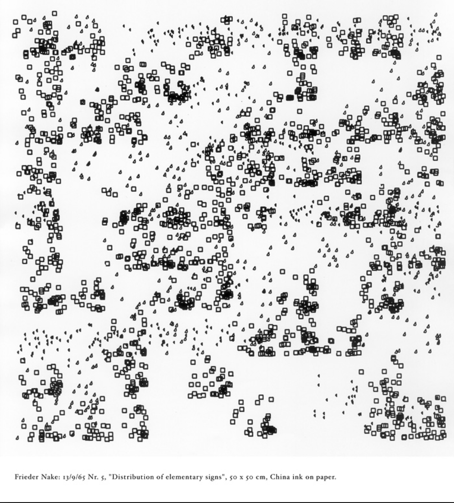

# Doodling with the Canvas API
<div class="left">
  [@knowuh](https://twitter.com/knowuh/)<br/>
  knowuh@gmail.com <br/>
  http://paessel.com/
</div>


<slide>

# What is this talk?

<vertical>


<vertical>


<vertical>
# What is this talk?
  * An introduction to creative coding.
  * Highlight real from a class *Sketching with Code*.
  * This talk is for newbies.
  * This talk is for cranky old-timers.

<vertical>
## What is this talk?
* Some visual tricks.
* Some art history.
* Some Javascript.
* An intro to [canvas 2d api](https://developer.mozilla.org/en-US/docs/Web/API/Canvas_API)
* We use naked Javascript.

<vertical>
## Why sketch with code?
  * To teach and learn programming.
  * To discover things and have fun.
  * For happy accidents.
  * It's good for your brain*.

</br></br>
*not a doctor*

<vertical>
## Why Canvas
  * Javascript is everywhere.
  * More immediate than SVG or WebGL.
  * No Frameworks, no building, single page.


<slide>
"I like to think of play not as an activity, but as an attitude, a way of engaging with the world"
<br/>–  *Mitchel Resnick*  (@mres)

<slide>

## Who am I?
  * A student and teacher of visual art and design.
  * Someone who has been programmg a long time.
  * I want you to make things.

<vertical>


<vertical>


<slide>

# Visual hacks
  * Sketch.
  * Use arbitrary constraints.
  * Learn about gestalt principles.
  * Some quick tips.

<vertical>
## Sketching
* Start on paper.
* Create many examples quickly.
* They are disposable.
* Good sketches generate questions.
* Process not product.

<br/><br/>

<span class="fragment">**Sketch**.</span>
<span class="fragment">**All**.</span>
<span class="fragment">**The**.</span>
<span class="fragment">**Time**.</span>

Note:
* Artschool 101
* Not precious.
* Can be code …
<vertical>

## Constraints
By holding some things constant, we focus on the possibilities of the remaining parameters.
* Music
* [Haiku](https://en.wikipedia.org/wiki/Haiku)
* [Dogme films](https://en.m.wikipedia.org/wiki/Dogme_95)
* Only paint in 2" squares.
* Only use 400 pixels.
* Only use black and white.

<vertical>
## Gestlat principles of design
  <div class="left">
    The Gestalt Principles are a set of laws arising from 1920s' psychology, describing how humans typically see objects by grouping similar elements, recognizing patterns and simplifying complex images. Designers use these to engage users via powerful -yet natural- "tricks" of perspective and best practice design standards.
  <div class="left">

<vertical>

## Gestlat principles of design
* Gestalt principles are real. They are grounded in the *mechanics* of human perception.
* Art, design, and [Optical illusions](https://en.wikipedia.org/wiki/Optical_illusion) exploit artifacts of human perception.

<vertical>
## Some gestalt princples are …

* Closure: Our brain fills in gaps.
* Proximity: We group closer-together elements.
* Continuation: We follow lines.
* Similarity: We look for differences and commonality of shape.

<vertical>

<vertical>

<vertical>
## Book about gestalt theory:
* ["Primer of Visual Literacy"](https://www.amazon.com/Primer-Visual-Literacy-Donis-Dondis/dp/0262540290) by Donis A. Dondis.

<slide>
# Artist cheat codes:
  * Currate.
  * Crop.
  * Contrast.
  * Accidents.
  * Fake it.
  * Steal and  **give credit**.
  <br/><br/>
<div>
  <span class="fragment">Make it **Big**.</span>
  <span class="fragment">Make it **red**.</span>
  <span class="fragment">Or make **many** of them.</span>
</div>

Note:
* Take 1000 photographs, and choose one.
* Crop: Your initial framing will be wrong. Direct attention. Cut out noise.
* Constrast: What is the focus, what will stand out?
* Accidents: investigate, celebrate, incorporate your accidents.
* Fake it: Its art. Its all fake. Their is no purity, its all for show.

<slide>
# Programming hacks
* Reduce friction.
* Wishful programming.
* Get *something* on the screen ASAP.
* Generalize.
* HSLA color.
* Google MDN.

<vertical>
## Wishful programming
```

  drawSquare(10, 10, 100)
  drawSquare(120, 10, 100)
  drawSquare(240, 10, 100)

  function drawSquare (x, y, size) {
    // Not sure what to do yet!
    console.log('drawing a square:', x, y, size)
  }


```


<slide>
# Finding Inspiration
From the earliest computer artists.

<vertical>
<div class="artist">
  <div> Michael Noll – Engineer<div>
  
</div>

<vertical>
<div class="artist">
  <div> Michael Noll – Engineer<div>
  
</div>

<vertical>
<div class="artist">
  <div> Michael Noll – Engineer<div>
  
</div>

<vertical>
<div class="artist">
  <div>Frieder Nake – Mathemetician<div>
  
</div>

<vertical>
<div class="artist">
  <div>Frieder Nake – Mathemetician<div>
  
</div>

<vertical>
<div class="artist">
  <div>Frieder Nake – Mathemetician<div>
  
</div>


<vertical>
<div class="artist">
  <div>Georg Nees – Mathematics & Philosophy<div>
  
</div>

<vertical>
<div class="artist">
  <div>Vera Molnar – Artist & Designer<div>
  
</div>

<vertical>
<div class="artist">
  <div>Vera Molnar – Artist & Designer<div>
  
</div>

<vertical>
<div class="artist">
  <div>Vera Molnar – Artist & Designer<div>
  
</div>


<slide>


<slide>
  

<slide>

## A Single page sketch template
```html
  <html>
    <head> … </head>
    <body>
      <canvas width="500" height="500"></canvas>
    </body>
    <script>

      // what we are doing is all in between these script tags
      var canvas = document.querySelector('canvas');
      var context = canvas.getContext('2d');

    </script>
  </html>
```

<slide>
## VM-01: Square on a canvas
<a href="/example/vm-01" target="sample">demo</a>

```javascript
    // Easy way to draw a rectantangle:  
    context.strokeRect(10, 10, 100, 100);

    // The hard way
    context.strokeStyle = "black";
    context.beginPath();
    context.moveTo(10,10);
    context.lineTo(100,10);
    context.lineTo(100,100);
    context.lineTo(10,100);
    context.lineTo(10,10);
    context.stroke();
```

<slide>
## VM-02: Multiple Squares
<a href="/example/vm-02" target="sample">demo</a>
```javascript
    // Draw a square at x,y of size:
    function drawSquare (xLoc, yLoc, size) {
      context.beginPath();
      context.moveTo(xLoc       ,  yLoc       );
      context.lineTo(xLoc + size,  yLoc       );
      context.lineTo(xLoc + size,  yLoc + size);
      context.lineTo(xLoc       ,  yLoc + size);
      context.closePath();
      context.stroke();
    }

    // draw some squares
    var squareSize = 100;
    drawSquare(10, 10, squareSize);
    drawSquare(120, 10, squareSize);

```


<slide>
## VM-03: Squares on a Grid

<a href="/example/vm-03" target="sample">demo</a>

```javascript
    var squareSize = 140;
    var padding = 10;

    // Draw a square at grid-y grid-y:
    function drawSquare(gridX, gridY) {
      var startX = gridX * (squareSize + padding) + padding;
      var startY = gridY * (squareSize + padding) + padding;
      context.beginPath();
      context.moveTo(startX,               startY);
      context.lineTo(startX + squareSize,  startY);
      context.lineTo(startX + squareSize,  startY + squareSize) ;
      context.lineTo(startX,               startY + squareSize) ;
      context.closePath();
      context.stroke();
    }

    drawSquare(0, 0);
    drawSquare(1, 0);
    drawSquare(2, 1);
    drawSquare(0, 2);
```


<slide>
## VM-04: Loop it
<a href="/example/vm-04" target="sample">demo</a>

```javascript
   // hella squares:
    var x, y;
    var numWide = 4;
    var numTall = 4;
    for(x=0; x < numWide; x++) {
      for(y=0; y < numTall; y++) {
        drawSquare(x,y);
      }
    }
```

<slide>
## Context & Transforms.

Remember this?


<vertical>
## We can change it with:

* `canvas.tranlate(…)`,
* `canvas.rotate(…)`,
* `canvas.scale(…)`
* `canvas.transform(…)`

<vertical>


<slide>
## VM-05: Make it big.
<a href="/example/vm-05" target="sample">demo</a>

```javascript
    // Variables:
    var gridSize = 1;
    var marginScale = 0.9;
    var numColumns = 3;

    function setgridSize() {
      if (canvas.width > canvas.height) {
        gridSize = canvas.height / numColumns;
      }
      else {
        gridSize = canvas.width / numColumns;
      }
    }

    function adjustMargins () {
      var size = gridSize * numColumns;
      var extraSpaceX = canvas.width - size;
      var extraSpaceY = canvas.height - size;
      context.translate(extraSpaceX/2, extraSpaceY/2);
      setgridSize()
    }

    function resize() {
      var {width: w, height: h}  = canvas.getBoundingClientRect();
      canvas.width = w;
      canvas.height = h;
      setgridSize();
      draw();
    }

    window.addEventListener("resize", resize);
```

<slide>
## VM-06: Futher Iteration.
<a href="/example/vm-06" target="sample">demo</a>
```javascript
function veraSquare() {
      var i = 0;
      var numSquares = 10;
      var stepSize = 1 / numSquares;
      // sale from  0 to 1 in numSquares steps
      for (i = 0; i <= 1; i += stepSize) {
        context.save();
        context.scale(i, i);
        drawSquare();
        context.restore();
      }
    }

    // Align drawing to our grid
    function drawInGrid (gridX, gridY, drawingFunction) {
      var halfGrid = gridSize / 2;
      context.save();
      context.translate(gridX * gridSize + halfGrid, gridY * gridSize + halfGrid);
      context.scale(marginScale, marginScale);
      drawingFunction();
      context.restore();
    }

    // draw hella squares:
    function draw () {
      setgridSize();
      adjustMargins();
      context.save();
      var x, y;
      for(x=0; x < numColumns; x++) {
        for(y=0; y < numColumns; y++) {
          drawInGrid(x, y, veraSquare);
        }
      }
      context.restore();
    }
    ```
<slide>
## VM-07: Imperfections and randomnesss
## VM-08: Parameters and Variations
## VM-09: HSLA Colors
## VM-11: Radial
## VM-12: Animation


<slide>
## Resources: low-friction tools

* [surge](https://surge.sh/) - instantly publish a website
* [code pen](https://codepen.io/) - scratch-pad for websites
* [live  server](https://www.npmjs.com/package/live-server) - quick feedback
* [Vistual Studio Code](https://code.visualstudio.com/) -- nice editor.
* [shader toy](https://www.shadertoy.com/) -- not for beginners

<vertical>
## Resources: inspiration and teachers:

* [Daniel Schiffman's Coding Train](https://www.youtube.com/user/shiffman) - [@shiffman](https://twitter.com/shiffman)
* [@invonvergent](https://twitter.com/inconvergent) [instructions](https://inconvergent.net/#writing)
* [@mxsage](https://twitter.com/mxsage) [instructions](https://www.sagejenson.com/physarum)
* [solving sol](http://solvingsol.com/solutions/) -- Sol Lewitt

<vertical>
## Resources: documentaiton & frameworks

* [MDN Canvas API docs](https://developer.mozilla.org/en-US/docs/Web/API/CanvasRenderingContext2D)
* [D3](https://d3js.org/) - SVG & Javascruot visualization toolkit
* [Processing](https://processing.org/) - granpappy of creative coding envs
* [Open Frameworks](https://openframeworks.cc/) -- C++ creative coding
* [ThreeJS](https://threejs.org/) - wrapper for canvas 3D API.

